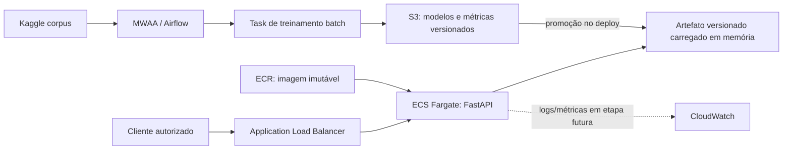

# Classificação multilabel de resumos médicos

Projeto das etapas 1 e 2 do Tech Challenge de Machine Learning Engineering. A
solução baixa o corpus público **Medical Abstracts TC Corpus**, reconstrói seus
rótulos multilabel por resumo, treina um baseline clássico reproduzível e expõe
inferência HTTP com FastAPI.

> **Uso educacional.** O corpus classifica assuntos de resumos científicos. Ele
> não contém gravidade, prioridade de atendimento, diagnóstico confirmado nem
> desfecho clínico. Portanto, este projeto **não classifica** `normal`, `atenção`
> ou `urgente`, não realiza triagem e não deve orientar decisões médicas.

## O que está implementado

- download em tempo de execução com a chamada obrigatória
  `kagglehub.dataset_download("saharalaa/medical-abstracts-tc-corpus")`;
- validação e normalização dos três CSVs do corpus;
- agrupamento de abstracts repetidos e agregação de todos os seus rótulos;
- TF-IDF com classificação one-vs-rest por regressão logística;
- divisão determinística por abstracts únicos, sem o mesmo texto nos dois lados;
- artefato `joblib` contendo pipeline, binarizador e metadados;
- métricas multilabel escritas somente por uma execução real de treinamento;
- API FastAPI com `GET /health` e `POST /predict`;
- Docker, Compose, benchmark HTTP e testes offline;
- DAG do Airflow para download, treinamento e promoção de artefatos.

Monitoramento de produção, alertas, drift e retreinamento automático pertencem a
etapas posteriores e não foram implementados aqui.

## Dados e decisão multilabel

Fonte obrigatória: [Kaggle — Medical Abstracts TC Corpus](https://www.kaggle.com/datasets/saharalaa/medical-abstracts-tc-corpus).
O download fornece:

| Arquivo | Colunas esperadas | Uso |
|---|---|---|
| `medical_tc_labels.csv` | `condition_label`, `condition_name` | dicionário de classes |
| `medical_tc_train.csv` | `condition_label`, `medical_abstract` | registros rotulados |
| `medical_tc_test.csv` | `condition_label`, `medical_abstract` | registros rotulados |

As cinco classes originais são preservadas:

1. `neoplasms`
2. `digestive system diseases`
3. `nervous system diseases`
4. `cardiovascular diseases`
5. `general pathological conditions`

Uma auditoria do corpus mostrou que o problema não é verdadeiramente
single-label: no arquivo de treino, 4.061 linhas pertencem a 1.956 grupos de
texto duplicado; no teste, são 231 linhas em 113 grupos; além disso, 988
abstracts aparecem nos dois arquivos com rótulos diferentes. Treinar diretamente
nas linhas criaria alvos contraditórios e vazamento entre treino e teste.

Por isso, a ingestão concatena os dois arquivos **somente para reconstruir a
anotação completa**, normaliza espaços, agrupa pelo texto e agrega os rótulos.
Depois cria uma nova divisão determinística por abstracts únicos. As métricas
resultantes são de uma avaliação interna multilabel; não devem ser comparadas
como se fossem o benchmark do split oficial do corpus.

O código exige ao menos 2.000 linhas brutas na execução de produção. Fixtures
pequenas existem apenas nos testes e nunca são usadas para gerar o artefato de
produção. O `kagglehub` mantém seu próprio cache; defina `KAGGLEHUB_CACHE` quando
quiser controlar a localização, especialmente em contêineres ou CI.

## Modelo e métricas

O baseline usa `TfidfVectorizer` e
`OneVsRestClassifier(LogisticRegression)`. Cada classe recebe uma probabilidade
independente; portanto, as cinco probabilidades **não precisam somar 1**. A
resposta inclui:

- `classification`: classe de maior probabilidade, para consumo simples;
- `predicted_labels`: todas as classes acima do limiar configurado (com fallback
  para a classe de maior probabilidade);
- `probabilities`: probabilidade independente de cada uma das cinco classes;
- `latency_ms`: tempo de inferência medido dentro da API;
- `model_version`: versão/fingerprint registrada no artefato.

`artifacts/metrics.json` só é criado após treinamento real. O repositório não
publica acurácia ou latência fictícia. Consulte esse arquivo para `f1_micro`,
`f1_macro`, `hamming_loss`, `subset_accuracy` e demais métricas produzidas pela
sua execução. Em multilabel, micro/macro F1 e métricas por classe são mais
informativas que uma acurácia isolada.

Uma execução real local, com o corpus baixado, agrupamento por texto,
`random_state=42` e o split interno descrito acima produziu: subset accuracy
`0,578807`, micro-F1 `0,790737`, macro-F1 `0,800366`, Jaccard por amostra
`0,744026` e Hamming loss `0,111042`. Esses números registram aquela execução;
não são métricas clínicas, comparação com o split oficial nem meta garantida.

## Execução local

Requer Python 3.11 ou superior.

```bash
python -m venv .venv
```

PowerShell:

```powershell
.\.venv\Scripts\Activate.ps1
python -m pip install --upgrade pip
python -m pip install -e ".[dev]"
```

Bash:

```bash
source .venv/bin/activate
python -m pip install --upgrade pip
python -m pip install -e ".[dev]"
```

Treine usando o download/cache do Kaggle:

```bash
python -m medical_triage.train \
  --model-path artifacts/model.joblib \
  --metrics-path artifacts/metrics.json
```

Para um corpus já baixado, sem nova chamada de rede:

```bash
python -m medical_triage.train \
  --dataset-dir /caminho/para/medical-abstracts-tc-corpus \
  --model-path artifacts/model.joblib \
  --metrics-path artifacts/metrics.json
```

Inicie a API depois que `artifacts/model.joblib` existir. O caminho pode ser
alterado com `MEDICAL_TRIAGE_MODEL_PATH`:

```bash
uvicorn medical_triage.api:app --host 0.0.0.0 --port 8000
```

Verifique a prontidão:

```bash
curl http://127.0.0.1:8000/health
```

Faça uma predição:

```bash
curl -X POST http://127.0.0.1:8000/predict \
  -H "Content-Type: application/json" \
  -d '{"text":"A patient with persistent chest discomfort underwent cardiac evaluation."}'
```

Textos vazios, compostos apenas por espaços ou acima do limite documentado pela
API recebem erro de validação `422`. Artefato ausente ou inválido deixa o health
check como não pronto e bloqueia predições com erro de serviço, em vez de
responder com um modelo improvisado.

## Testes e qualidade

Os testes usam CSVs temporários mínimos e modelos pequenos; não acessam Kaggle e
não escrevem artefatos no repositório.

```bash
python -m ruff check .
python -m pytest
```

Para cobertura local:

```bash
python -m pytest --cov=medical_triage --cov-report=term-missing
```

A automação em `.github/workflows/ci.yml` executa as verificações definidas para
push e pull request. Nenhum segredo do Kaggle deve ser incluído no workflow.

## Docker e Compose

O build da imagem instala código e dependências, mas deliberadamente não baixa o
dataset nem treina. Isso mantém a imagem reproduzível e evita embutir cache ou
credenciais.

```bash
docker build -t medical-abstracts-api .
```

O Compose configura dois volumes nomeados: um para o cache do Kaggle e outro
para os artefatos. No primeiro `up`, `TRAIN_IF_MISSING=1` permite que o entrypoint
baixe e treine uma única vez antes de iniciar a API; reinícios reutilizam os
volumes.

```bash
docker compose up --build
```

Para separar explicitamente treino e serving:

```bash
docker compose run --rm --entrypoint python api -m medical_triage.train \
  --model-path /app/artifacts/model.joblib \
  --metrics-path /app/artifacts/metrics.json
docker compose up api
```

Em produção, promova um artefato já validado, monte-o no contêiner e mantenha
`TRAIN_IF_MISSING=0`; uma réplica de serving não deve decidir treinar sozinha.

## Benchmark de latência

Com a API ativa:

```bash
python scripts/benchmark.py \
  --url http://127.0.0.1:8000/predict \
  --warmup 10 \
  --requests 100 \
  --output artifacts/benchmark.json
```

O script mede latência HTTP ponta a ponta (p50/p95/p99), registra também a
latência interna devolvida pela API quando disponível e grava JSON apenas quando
é executado com sucesso. O modo é sequencial; ele caracteriza latência, não a
capacidade máxima sob concorrência.

### Baseline local medido

O arquivo [`docs/baseline-local.json`](docs/baseline-local.json) foi produzido
por uma execução real em 12/09/2026 contra Uvicorn em `localhost`: 10 warm-ups,
100 requisições sequenciais e 100% de respostas HTTP 200.

| Medida | Cliente HTTP | Inferência reportada pela API |
|---|---:|---:|
| média | 18,333 ms | 4,008 ms |
| p50 | 16,451 ms | 3,898 ms |
| p95 | 33,694 ms | 5,869 ms |
| p99 | 34,746 ms | 6,491 ms |
| máximo | 35,971 ms | 7,609 ms |

O throughput sequencial observado foi `54,206 req/s`. É um registro reproduzível
do ambiente local e de uma entrada fixa, não um SLA, teste de carga concorrente
ou promessa para hardware/rede diferentes.

## Airflow (etapa 2)

A DAG `train_medical_abstracts_classifier` mantém download e treinamento dentro
das tasks; importar a DAG não acessa a rede. Consulte
[`airflow/README.md`](airflow/README.md) para configuração completa.

```bash
python -m pip install -r airflow/requirements.txt
python -m pip install -e .
airflow dags trigger train_medical_abstracts_classifier
```

Por padrão a DAG é manual. `AIRFLOW_TRAIN_SCHEDULE` aceita um preset ou cron, e
`MEDICAL_TRIAGE_ARTIFACT_DIR` direciona a saída para armazenamento persistente.
A promoção publica `model.joblib`, `metrics.json` e, por último,
`promotion.json` como marcador de conclusão.

## Decisão de arquitetura AWS

Inferência é **real-time**: o artefato linear é pequeno, o custo de predição é
baixo e um consumidor interativo se beneficia de resposta imediata. Treinamento
é **batch**: o corpus é versionado, o agrupamento precisa considerar o conjunto
inteiro e não há justificativa para atualização online por requisição.

Arquitetura teórica recomendada:



- **ECS Fargate + ALB** foi escolhido para servir a aplicação Docker sem manter
  instâncias e com escalabilidade horizontal previsível.
- **ECR** guarda a imagem imutável; a imagem e o modelo têm ciclos de versão
  separados.
- **S3 com versionamento** é a fonte de artefatos aprovados. O serviço recebe uma
  versão fixa no deploy, evitando troca parcial durante requisições.
- **MWAA/Airflow** agenda o fluxo batch. Para cargas maiores, a task pode delegar
  treinamento a ECS RunTask ou SageMaker Training sem mudar o contrato do
  artefato.
- ALB pode terminar TLS; tarefas ficam em sub-redes privadas e usam IAM roles de
  mínimo privilégio. Textos médicos não devem aparecer em logs. Autenticação,
  WAF, criptografia KMS e política de retenção são requisitos antes de qualquer
  uso com dados sensíveis.

Uma alternativa totalmente batch (arquivo de entrada para arquivo de saída) tem
menor custo em grandes lotes, mas não atende interação imediata. Lambda não é a
primeira escolha aqui porque tamanho das dependências, cold start e gestão do
artefato tornam ECS mais simples e previsível para este baseline.

## Estrutura

```text
.
├── src/medical_triage/       # ingestão, modelo, treino e FastAPI
├── scripts/                  # entrypoint e benchmark HTTP
├── tests/                    # testes offline
├── airflow/                  # DAG e dependências da etapa 2
├── .github/workflows/ci.yml  # integração contínua
├── Dockerfile
├── compose.yaml
├── pyproject.toml
└── requirements.txt
```

## Limitações científicas e operacionais

- As classes indicam tópicos de doença, não risco individual ou urgência.
- A agregação corrige contradições exatas observáveis, mas não transforma o
  corpus em uma anotação clínica completa.
- A divisão aleatória determinística não garante generalização entre hospitais,
  períodos, populações ou estilos de escrita.
- TF-IDF não compreende negação, temporalidade ou contexto como um especialista.
- Probabilidade do classificador não é probabilidade de doença e precisa de
  calibração/validação externa para qualquer novo domínio.
- O serviço não inclui monitoramento, auditoria clínica, explicabilidade validada,
  autenticação nem gestão de consentimento.

Referência do corpus original: [Medical-Abstracts-TC-Corpus](https://github.com/sebischair/Medical-Abstracts-TC-Corpus).
